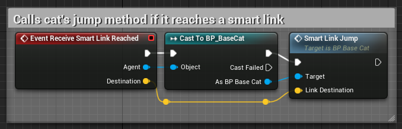
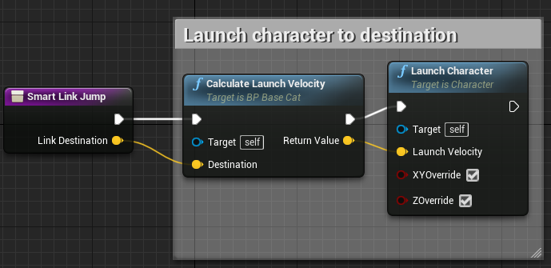
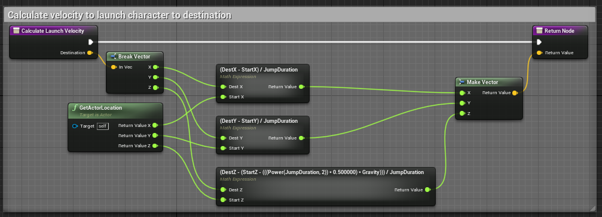
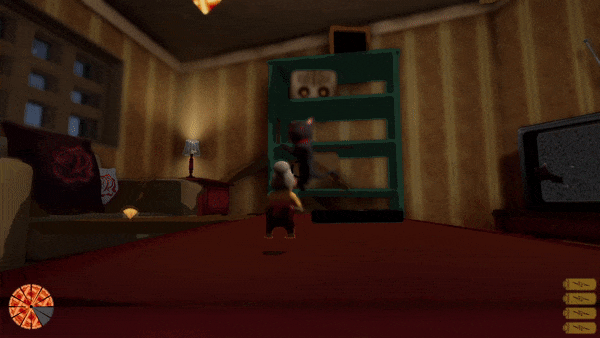

# Smart Link + Jump

Sample illustrating how AI units moved between discrete navigation areas using smart links. When a unit reaches the smart link, that fires an event which passes the smart link's destination to the unit's "Smart Link Jump" method.
 

 
This method on the AI calculates the velocity required to reach the end, and launches the character using Unreal's built-in "Launch Character" method.
 

 

## Demo

