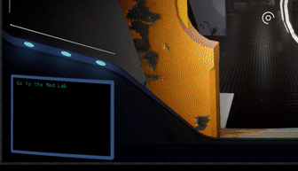

# Rotate on cube

Sample demonstrating how Miyamura's Might handled:
i) Rotation of the player when moving between walls.
ii) Rotation of the camera based on a delegate.
iii) Gravity for projectiles on different surfaces.

