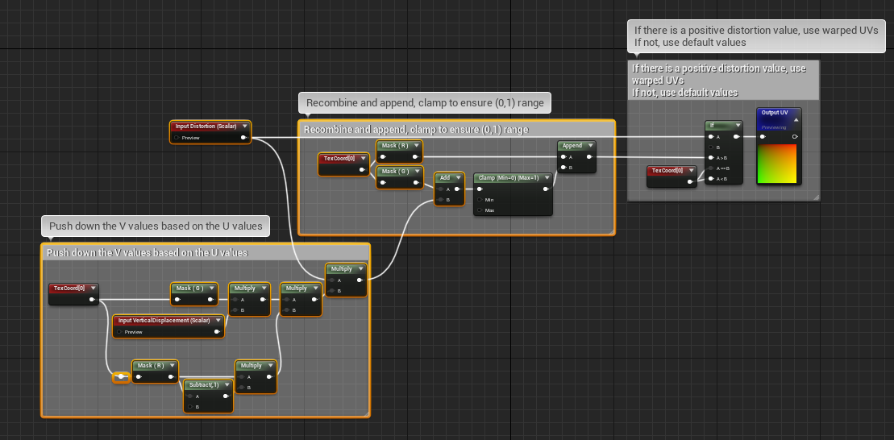
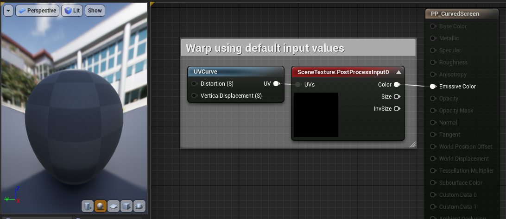
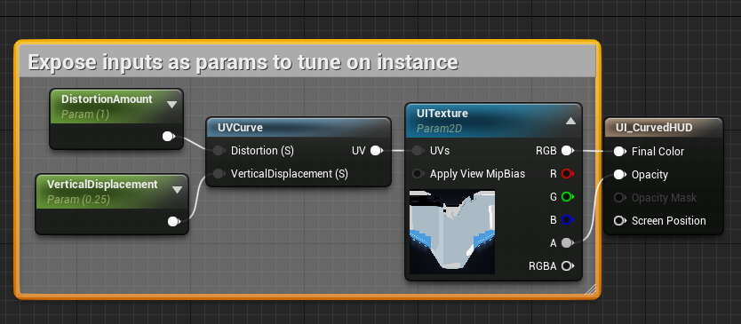
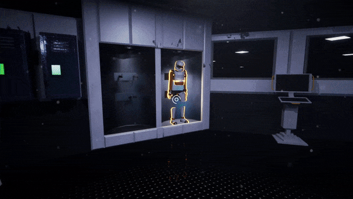

# Warp HUD and Scene

Sample showing the use of a material function to warp UVs based off scalar displacement and distortion inputs.
 

 

We used this function to sample the scene as a texture and warp it's UVs, creating an effect similar to the curvature/distortion that comes from wearing a glass helmet. This material was applied as a post processing effect attached to the camera.
 

 

We also use this function on the helmet outline material that gets drawn on the HUD, but tuned the parameters on it's material instance to provide a slightly less exagerated effect.
 

 

## Demo

## Reference
[Ryan Laley's Curved HUD effect tutorial](https://www.youtube.com/watch?v=-8lWA1aaSCc)